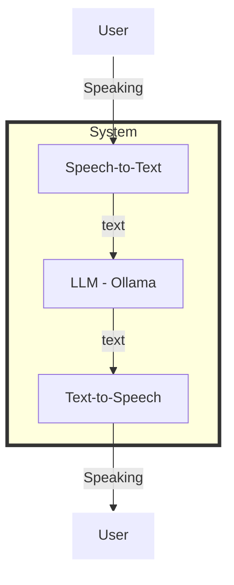
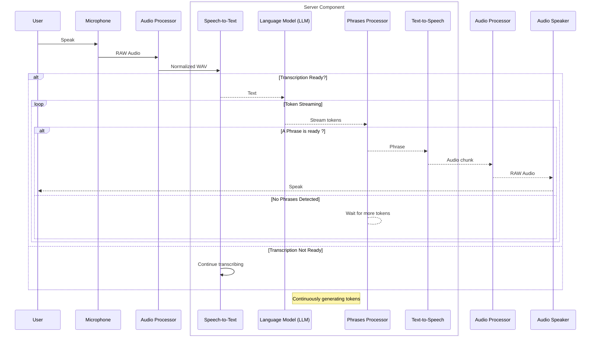

**My personal english coach**
=============================

A fully self-hosted conversational chatbot built on a customized LLama 3.2 LLM and wrapped with OpenAI Whisper and Coqui-TTS for real-time speech-to-text and text-to-speech conversions.

# Videos
YouTube video demo - local website  
https://www.youtube.com/shorts/ov97UJniI5M

YouTube video demo - console mode  
https://youtu.be/u1os7qTb7eU


# Overview

Enjoy instant, unlimited chat with a personalized conversational agent to help you develop your spoken English.  
It gives you personalized advice to help you improve your conversational skills.  
This chatbot is always available and powered for discussions in English, while benefiting from the general culture of an LLM. 
What's more, it's completely free and keeps no conversation history.     
This self-hosted chatbot integrates OpenAI Whisper for speech recognition and coqui-TTS for text-to-speech, providing excellent performance/resource ratios.  
Speech-to-text (STT) transcribes the user's speech into text.  
The transcribed text is analyzed by the customized LLM: it takes into account the speech-to-text limitations, suggests linguistic corrections and feeds the conversation.  
Chatbot responses are generated in real time using an asynchronous background process that parallelizes the generation of text and audio files.    
The application features a local client in console mode, as well as a web client/server solution containing a lightweight chat room website.  



## Detailed process  
This diagram will show how speech-to-text conversion triggers the start of token streaming by the
Language Model (LLM), which in turn triggers phrase processor and sends them to text-to-speech for audio chunk generation,
allowing audio chunks from earlier responses to play while the LLM is still generating further content.




## Explanation:
1. **User Speaks**: The user provides speech input captured as audio content.
2. **Speech-to-Text (STT)**: The spoken words are converted into text.
3. **Transcription Ready?**: If the transcription is ready, it is sent to the Language Model (LLM).
4. **Token Streaming**: The LLM starts streaming tokens continuously.
5. **Phrase Processor**: As tokens are streamed, ending phrases are detected.
6. **Phrases Detected?**: If phrases are detected:
   - They are sent to Text-to-Speech (TTS).
   - TTS generates audio chunks.
   - AudioOutput plays the generated audio chunks.
7. **No Phrases Detected**: If no phrases are detected yet, Phrase Processor continues waiting for more tokens.

This sequence diagram effectively conveys how each component interacts asynchronously to provide real-time audio
feedback during continuous language model responses.

# Dependencies and hardware requirements

This application requires:
* A recent NVIDIA GPU with CUDA and at least 4Go of VRAM
* Python packages including PyTorch with CUDA
* A local Ollama server with Llama3.2 model customised to act as an english coach
* OpenAI whisper library for speech-to-text
* Coqui-TTS library for text-to-speech

The whole installation will use ~10Go:
* Ollama server provided with Llama3.2: ~2Go
* Python packages including PyTorch with CUDA: ~6Go
* OpenAI whisper model: base ~150Mo (default), turbo ~1,6Go
* Coqui-TTS Tacotron 2 model ~1Go


# Features

* Conversational, _speech-to-speech_, real-time AI chatbot
* Split solution with client / server sides to have remote AI process
* Standardized Audio interfaces
* Efficient Speech-to-text technology using a local instance of OpenAI Whisper
* Natural Text-to-Speech technology using a local instance of Tacotron 2 with Coqui-TTS
* Response generation using a Large Language Model (LLM) customised to act as an english coach
* Asynchronous and paralleled processes for LLM token generation and audio chunks preparation
* Integration with FastAPI framework for self-hosted split client/server

# Installation
## NVIDIA GPU with driver and CUDA ?
**_First of all_**, check you have NVIDIA driver installed with CUDA compiler
```bash
nvcc --version
```
You should get `NVIDIA (R) Cuda compiler driver` details.  
If not, **_don't go further_**, check your NVIDIA GPU driver and CUDA tools installation.

## Python dependencies

Download and install complete Python 3.11.9: https://www.python.org/downloads/release/python-3119/  
_This application was only tested with Python 3.11_  

Check that the `python` command returns the correct version 3.11
```bash
python -V
```
Should return: `Python 3.11.8`  
N.B: If the `python` command is not working, try `python3` instead or check your system environment variables. In case of `python3` replace in all following command lines...  

To build local virtual python environment, in from the project root folder:
```bash
python -m venv .venv
```
Activate virtual python environment:
```bash
.venv\Scripts\activate
```
Now you should see `(.venv)` on the left of the prompt  

**The application needs PyTorch with CUDA to have all available GPU resources. If this step fails, no need to go further...**  

To install the PyTorch with CUDA:
```bash
pip install torch --index-url https://download.pytorch.org/whl/cu124
```
N.B: The link https://download.pytorch.org/whl/cu124 refers to last current wheel. This link may change over time and depend on your GPU.  

To install the python dependencies required for this project in the virtual environment:
```bash
pip install -r requirements.txt
```
This will install all the necessary packages, including FastAPI, OpenAI Whisper, Coqui-TTS, and other dependencies.


## Ollama Server and LLM models
Download and install Ollama, visit https://ollama.com/  

Once Ollama is installed, download llama3.2 model: 
```bash
ollama pull llama3.2
```
Build the customised model, using provided `Modelfile` in the `app`:
```bash
cd app
ollama create english_coach_model -f ./Modelfile
```

Optionally, remove original Llama3.2 model:
```bash
ollama rm llama3.2
```

**At this stage, the application is installed.**   
**TTS and STT models will be downloaded automatically on first startup.** 

## Rescue Guide

| Issue                                                                                              | Solution                                             |
|----------------------------------------------------------------------------------------------------|------------------------------------------------------|
| `ollama._types.ResponseError: model "english_coach_model:latest" not found, try pulling it first`  | Build the customised ollama model                    |
| `AssertionError: Torch not compiled with CUDA enabled`| Install a compiled PyTorch package with CUDA enabled |
| `httpx.ConnectError: All connection attempts failed`| Install Ollama server                                |


### Using a existing or separate instance of Ollama server
You can use an independent Ollama server using this logic in the `chatbot_client.py`:

Replace
```python
chatbot_client = ChatbotClient()
```
With
```python
chatbot_server= ChatbotServer(ollama_server="https://anyollamaserver.com:11434")
chatbot_client = ChatbotClient(chatbot_server=chatbot_server)
```

# Running the Chatbot
On first startup, OpenAI Whisper and Coqui-TTS models are downloaded into local subfolders `./coqui_models`and `./whisper_models`.
## Using the web server and lightweight website

To run the chatbot using web server, execute the following command from the `app` folder:
```bash
cd app # Optional 
uvicorn main:app --host 127.0.0.1 --port 8080
```
This will start the local web server, use your preferred web browser visit http://127.0.0.1:8080  
You'll need to authorize your web browser to access your microphone.

## Using the console client

To run the chatbot using console client, execute the following command from the `app` folder:
```bash
cd app # Optional 
python chatbot_client.py
```


# License

This project is licensed under the GNU GPLv3 License. Please see the `LICENSE` file in the project root directory for more information.

# Contributing

Contributions to this project are welcome!  
If you'd like to contribute, please fork the repository and submit a pull request with your changes.

# Acknowledgments

* OpenAI Whisper for speech-to-text technology
* Coqui-TTS for text-to-speech synthesis
* FastAPI for efficient and scalable development
* OpenAI Whisper for speech-to-text technology
* Optimised asynchronous and background processes to parallelize LLM chat with audio generation


